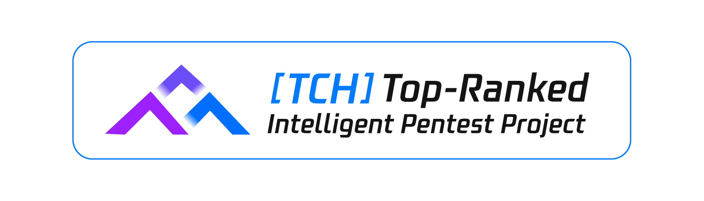
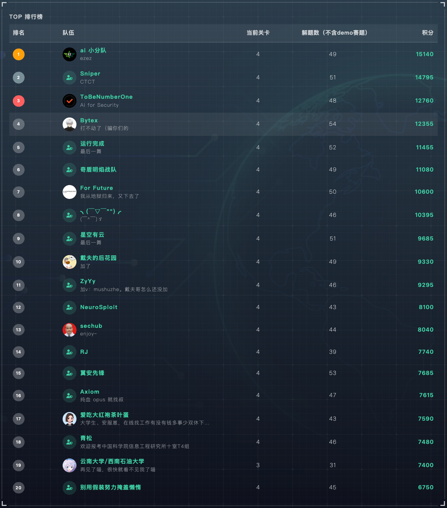

 
# Cairn
> TCH·腾讯云黑客松第二届智能渗透挑战赛唯一 AK 战队（Bytex@起零衍迹实验室） / 线上第四名
>
> 比赛复盘文章：https://mp.weixin.qq.com/s/DlpEH7bVr0xi0VawPJs3XA

代码还在整理中，预计近期开源...

# ⚖️ License
This project is licensed under **GNU AGPLv3** for personal and educational use.

**Commercial Use**: If you wish to use this project in a commercial or proprietary environment without the AGPL-3.0 open-source obligations, **please contact me to obtain a commercial license.**

**Contributions**: By submitting a Pull Request, you agree that your contributions may be used under both the AGPL-3.0 and the project's commercial license.