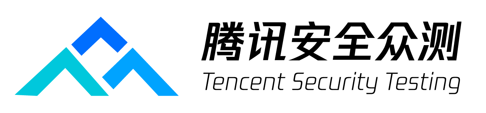
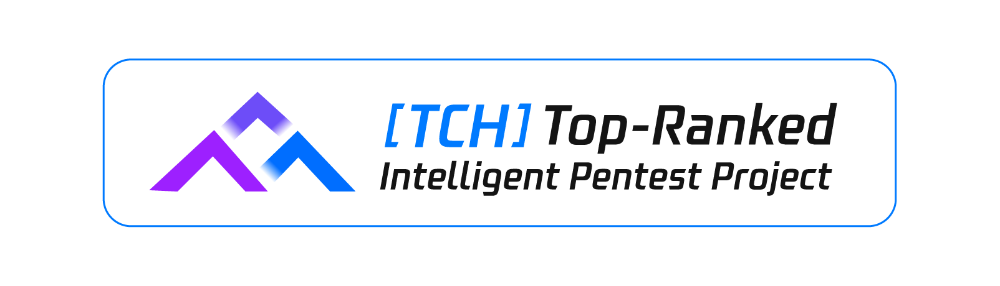

# Cairn
### More Than Just AI Penetration Testing — Towards General State-Space Search

  
  

Cairn is a general-purpose problem-solving engine.  It defines no roles, no workflows. Given an origin and a goal, it searches for a path through an unknown state space.  AI Penetration Testing is one such problem — and a proven one.

## What is Cairn?

## ⚖️ License
This project is licensed under **GNU AGPLv3** for personal and educational use.

**Commercial Use**: If you wish to use this project in a commercial or proprietary environment without the AGPL-3.0 open-source obligations, **please contact me to obtain a commercial license.**

**Contributions**: By submitting a Pull Request, you agree that your contributions may be used under both the AGPL-3.0 and the project's commercial license.
